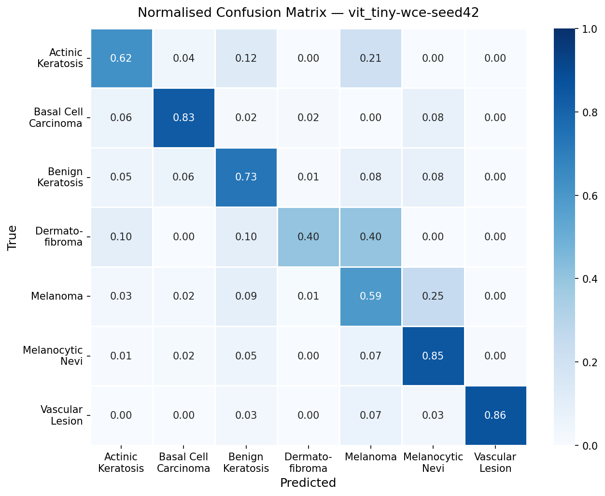
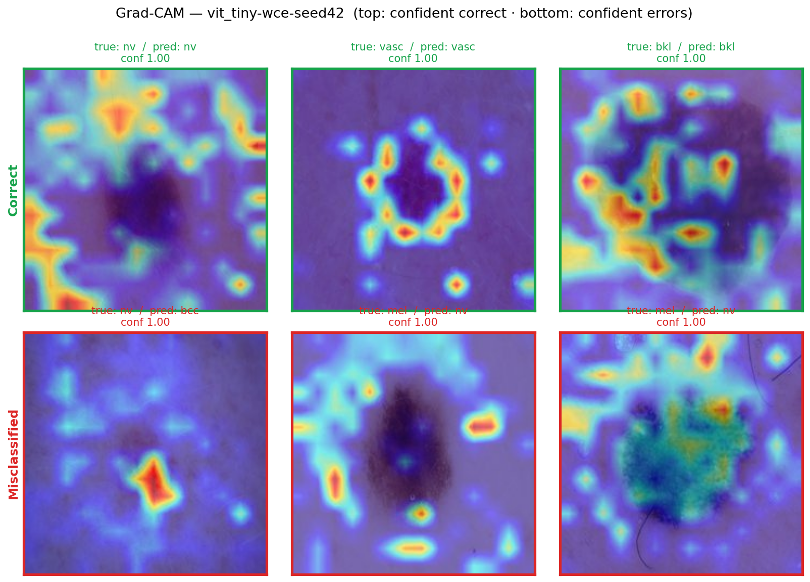

# Skin Lesion Classifier — 醫療影像深度學習

[](https://github.com/liouaquarius/skin-lesion-classifier/actions/workflows/ci.yml)

**🔗 線上 Demo：<https://liouaquarius.github.io/skin-lesion-classifier/>**

> Multi-class skin lesion classification on HAM10000: comparing CNN and
> Vision Transformer architectures under class-imbalanced conditions,
> with experiment tracking, automated testing, and end-to-end deployment.

前端 GitHub Pages + 後端 Hugging Face Spaces。**Results** 分頁為靜態實驗結果儀表板（秒開）；**Classifier** 分頁呼叫後端推論——後端閒置會休眠，首次分類可能需約 30 秒喚醒模型伺服器。

## 免責聲明 / Disclaimer

本專案為**研究與教育用途之展示**。所訓練的模型**並非**經認證的醫療器材，
**不得**用於臨床診斷或任何醫療決策。實際醫療問題請務必諮詢合格的醫療專業人員。

> This project is a research and educational demonstration. The trained models
> are **NOT** certified medical devices and **MUST NOT** be used for clinical
> diagnosis or medical decision-making. Always consult qualified medical
> professionals for actual medical concerns.

完整的適用範圍、訓練資料分布與**模型限制**（少數類樣本不足、melanoma 漏判風險等）見 [MODEL_CARD.md](MODEL_CARD.md)。

HAM10000 資料集採 CC BY-NC 4.0 授權，本專案僅作非商業之教育用途使用。

---

## 專案簡介

在 HAM10000 皮膚鏡影像資料集（10,015 張，7 類，最大不平衡比 58.3×）上建立多類別分類器，
比較 **CNN（ResNet18 / EfficientNet-B0）** 與 **Vision Transformer（ViT-Tiny）** 架構，
並針對類別不平衡設計三組 loss 對照：

| Loss | 說明 |
|------|------|
| `cross_entropy` | 基線 |
| `weighted_ce` | 訓練集頻率的反比權重 |
| `focal` | Focal Loss（γ=2.0），抑制 easy negative |

每組實驗均以 **病灶感知分組切割（lesion-aware split）** 防止資料洩漏，
並以 **MLflow** 追蹤 per-class sensitivity、macro AUC 等指標。
推論結果整合 **Grad-CAM** 熱力圖，透過 **FastAPI + Vue 3** 提供互動式 demo。

## 資料集 (Dataset)

**HAM10000**（Human Against Machine with 10,015 training images）皮膚鏡影像資料集，經 Kaggle [`kmader/skin-cancer-mnist-ham10000`](https://www.kaggle.com/datasets/kmader/skin-cancer-mnist-ham10000) 下載（[`scripts/download_data.py`](scripts/download_data.py)）。

| 項目 | 內容 |
|------|------|
| 影像數 | 10,015 張皮膚鏡（dermatoscopic）影像 |
| 類別 | 7 類皮膚病灶 |
| 不平衡 | 最大比例 **58.3×**（nv : df） |
| 切割 | 病灶感知切割（lesion-aware split，防同一病灶跨 split 洩漏），seed 42 |
| 來源 | Tschandl, Rosendahl & Kittler, *Scientific Data* (2018) |
| 授權 | CC BY-NC 4.0（僅限非商業教育用途） |

| 類別 | 全名 | 樣本數 | 佔比 |
|------|------|------:|-----:|
| nv | Melanocytic Nevi | 6,705 | 66.9% |
| mel | Melanoma | 1,113 | 11.1% |
| bkl | Benign Keratosis | 1,099 | 11.0% |
| bcc | Basal Cell Carcinoma | 514 | 5.1% |
| akiec | Actinic Keratosis / IEC | 327 | 3.3% |
| vasc | Vascular Lesion | 142 | 1.4% |
| df | Dermatofibroma | 115 | 1.1% |

> 嚴重的類別不平衡（多數類 nv 佔 67%，少數類 df 僅 115 張）正是本專案以 weighted-CE / focal loss 對照、並以 per-class sensitivity 與 macro 指標（而非單看 accuracy）評估的核心動機。

## 模型架構

三種架構皆以 ImageNet 預訓練權重初始化，輸出層改為 7 類。CPU 延遲為單張 224² 影像的平均推論時間（部署目標環境；數值依硬體而異，供相對比較參考）。

| 架構 | 參數量 | Checkpoint | CPU 延遲 | 預訓練來源 |
|------|------:|-----------:|--------:|-----------|
| ResNet18 | 11.18M | 44.8 MB | 17.5 ms | torchvision / ImageNet |
| EfficientNet-B0 | 4.02M | 16.4 MB | 17.1 ms | torchvision / ImageNet |
| ViT-Tiny | 5.53M | 22.2 MB | 14.4 ms | timm / ImageNet |

> ViT-Tiny 在本實驗同時取得最佳指標與最低 CPU 延遲，模型體積亦適中——這也是 demo 選用它的原因之一。量測腳本見 [`scripts/profile_models.py`](scripts/profile_models.py)。

## 實驗結果

9 組實驗（3 架構 × 3 loss）於**留出測試集**（病灶感知切割，seed 42）的結果。
`sens(mel)` 為 melanoma（黑色素瘤）敏感度——臨床上最不容漏判的類別。

| 架構 | loss | accuracy | macro F1 | macro AUC | sens(mel) |
|------|------|---------:|---------:|----------:|----------:|
| ResNet18 | ce | 0.8016 | 0.6124 | 0.9556 | 0.478 |
| ResNet18 | wce | 0.7511 | 0.6074 | 0.9411 | 0.661 |
| ResNet18 | focal | 0.7302 | 0.5769 | 0.9273 | 0.677 |
| EfficientNet-B0 | ce | 0.8062 | 0.6491 | 0.9520 | 0.489 |
| EfficientNet-B0 | wce | 0.7708 | 0.6266 | 0.9446 | 0.602 |
| EfficientNet-B0 | focal | 0.7518 | 0.6345 | 0.9462 | 0.608 |
| **ViT-Tiny** | **ce** | **0.8166** | 0.6676 | **0.9603** | 0.468 |
| **ViT-Tiny** | **wce** | 0.7950 | **0.6693** | 0.9602 | 0.591 |
| ViT-Tiny | focal | 0.7963 | 0.6558 | 0.9509 | 0.425 |


**主要發現：**

- **ViT-Tiny 整體領先**：accuracy、macro F1、macro AUC 的最佳值皆由 ViT-Tiny 取得，優於兩個 CNN 基線。
- **準確率 ↔ 少數類敏感度的取捨**：各架構下 `cross_entropy` 的 accuracy 最高，但 melanoma 等少數類敏感度最低；改用 `weighted_ce` / `focal` 會犧牲數個百分點 accuracy，換取明顯更高的 melanoma 敏感度（例如 ResNet18：0.478 → 0.66+）。
- **以臨床「不漏判黑色素瘤」為目標時**，weighted-CE / focal 優於只看 accuracy 的 cross-entropy。

> Demo 後端預設服務 **ViT-Tiny + weighted-CE**（macro F1 最佳、melanoma 敏感度佳，兼顧整體表現與不平衡處理）。每組的混淆矩陣與 per-class sensitivity 圖見 [`results/visualizations/`](results/visualizations/)。

## 可解釋性與誤判分析

部署模型 **ViT-Tiny + weighted-CE** 在測試集的混淆矩陣（列正規化）：



Grad-CAM 視覺化——上排為高信心**正確**預測，下排為高信心**誤判**：



最具臨床意義的失敗模式是 **melanoma 被以接近 1.0 的信心誤判為 nevi（良性痣）**：模型對錯誤的良性判斷給出極高信心，正凸顯 [模型卡](MODEL_CARD.md) 所述「不可用於臨床」的核心理由。Grad-CAM 圖由 [`scripts/grad_cam_gallery.py`](scripts/grad_cam_gallery.py) 產生。

## 技術棧

| 層面 | 技術 |
|------|------|
| 建模 / 訓練 | PyTorch · torchvision · timm · scikit-learn |
| 實驗追蹤 | MLflow |
| 可解釋性 | Grad-CAM（pytorch-grad-cam） |
| 資料 / EDA | pandas · matplotlib · seaborn |
| 後端 | FastAPI · Pydantic · Uvicorn |
| 前端 | Vue 3 · Vite · TypeScript |
| 測試 / 品質 | pytest · pytest-cov · ruff |
| CI / 容器 | GitHub Actions · Docker（CPU-only） |
| 環境管理 | uv（Python 3.11） |

## 快速開始（開發環境）

```bash
# 1. 安裝依賴
uv sync --extra dev

# 2. 下載資料集（需 Kaggle API token）
uv run --extra data python -u scripts/download_data.py

# 3. 執行測試
uv run pytest -v --cov=src --cov-report=term-missing

# 4. 訓練並評估（一條龍：train → 測試集評估；以 ResNet18 + cross-entropy 為例）
uv run python scripts/run_experiment.py configs/resnet18_ce.yaml

# 5. 檢查產物是否齊全（MLflow run + checkpoint / metrics JSON / 圖）
uv run python scripts/inspect_runs.py

# 6. 啟動推論服務（後端）
uv run uvicorn backend.main:app --reload

# 7. 啟動前端（另開 terminal）
cd frontend && npm install && npm run dev
```

瀏覽器開 `http://localhost:5173`，介面分兩個分頁：

- **Classifier**：上傳影像 → 取得分類結果與 Grad-CAM 熱力圖（需後端）。
- **Results**：靜態實驗結果儀表板——模型比較表、accuracy vs melanoma sensitivity 彙整圖、逐模型混淆矩陣 / per-class 敏感度切換、Grad-CAM 成功 / 誤判 gallery。**純靜態，不需後端即可瀏覽**。

> Results 分頁的資料由 [`scripts/build_dashboard_data.py`](scripts/build_dashboard_data.py) 從 9 份 test metrics 彙整、複製到 `frontend/public/`；重訓模型後重跑此腳本即可更新。

`run_experiment.py` 會依序對每個 config 執行「訓練 → 測試集評估」，每個 config 在獨立子程序中跑、互不影響，並在結尾列出產物完整性。可一次帶多個 config（例如 `configs/*.yaml` 跑完全部 9 組）；若只想單獨執行某一步，仍可分別呼叫 `python -m src.train` 與 `scripts/bake_results.py`。`inspect_runs.py` 則用於檢查 / 清理 MLflow run 與其磁碟產物。

## 重現性 (Reproducibility)

- **隨機種子**：所有實驗固定 `seed 42`（random / numpy / torch / cuda）。
- **資料切割**：病灶感知切割（lesion-aware split），同 seed 確保 train / val / test 一致、無洩漏。
- **環境**：Python 3.11、PyTorch 2.12.0（CUDA 12.6）；訓練於 NVIDIA RTX 4050 Laptop（6 GB）。
- **訓練設定**：30 epochs、AdamW（lr 1e-4、wd 1e-4）、cosine LR、混合精度（AMP）、batch 32、影像 224²。
- **訓練時長**：單組 30 epochs 約 15–30 分鐘（依架構與系統負載；EfficientNet-B0 最快、ViT-Tiny 較慢），9 組合計約 3.4 小時。每個 run 的精確 start / end 時間與逐 epoch 指標皆記錄於 MLflow。
- **一鍵重現全部 9 組**（train → 測試集評估）：

  ```bash
  uv run python scripts/run_experiment.py configs/*.yaml
  ```

- **檢視實驗追蹤**（params / metrics / 訓練時長）：

  ```bash
  uv run mlflow ui --backend-store-uri sqlite:///mlruns/mlflow.db
  ```

## 專案架構

```
skin-lesion-classifier/
├── src/
│   ├── data/          # SkinLesionDataset · build_transforms · lesion_aware_split
│   ├── models/        # build_resnet18 · build_efficientnet_b0 · build_vit_tiny
│   ├── losses/        # FocalLoss · WeightedCrossEntropy · build_loss
│   ├── train.py       # 訓練迴圈（MLflow · AMP · cosine LR）
│   ├── evaluate.py    # accuracy · per-class sensitivity · macro F1/AUC · confusion matrix
│   └── inference.py   # Predictor（predict · explain with Grad-CAM）
├── backend/
│   ├── main.py        # FastAPI：POST /predict · POST /explain · GET /health
│   ├── schemas.py     # PredictionResponse · ExplainResponse
│   ├── Dockerfile     # CPU-only 推論 image（python:3.11-slim）
│   └── requirements.txt
├── frontend/          # Vue 3 + TypeScript（Vite，proxy → :8000）
│   ├── src/
│   │   ├── App.vue           # 外殼 + Classifier / Results 分頁
│   │   └── views/            # ClassifierView · ResultsView（靜態儀表板）
│   └── public/        # results_summary.json + 圖（Results 靜態資料）
├── configs/           # 9 組：{resnet18,efficientnet_b0,vit_tiny}_{ce,wce,focal}.yaml
├── notebooks/         # 01_eda.ipynb（含輸出）
├── scripts/
│   ├── download_data.py        # Kaggle API 下載並整理 HAM10000
│   ├── run_experiment.py       # train → bake 一條龍（可批次多個 config）
│   ├── bake_results.py         # 測試集評估 → JSON metrics + PNG 視覺化
│   ├── inspect_runs.py         # 檢查 / 清理 MLflow run 與產物完整性
│   ├── plot_comparison.py      # 跨模型 accuracy vs melanoma sensitivity 圖
│   ├── profile_models.py       # 各架構 params / size / CPU latency
│   ├── grad_cam_gallery.py     # 成功 / 誤判 Grad-CAM 拼圖
│   └── build_dashboard_data.py # 彙整前端 Results 儀表板資料
├── tests/             # 33 個測試；合成 fixture，CI 不需真實資料集
└── results/
    ├── checkpoints/   # 訓練產生的 .pt（不入庫）
    ├── metrics/       # bake_results 輸出的 JSON
    └── visualizations/  # 混淆矩陣、per-class sensitivity PNG
```

## 授權 License

- **程式碼 Code**：MIT License（見 [LICENSE](LICENSE)）
- **資料集 Dataset**：HAM10000 採 CC BY-NC 4.0，僅供非商業教育用途

## 致謝 Acknowledgements

- **HAM10000 資料集** — Tschandl, P., Rosendahl, C. & Kittler, H., *The HAM10000 dataset: A large collection of multi-source dermatoscopic images of common pigmented skin lesions* (Scientific Data, 2018)；採 CC BY-NC 4.0。
- **預訓練權重** — ImageNet 預訓練模型來自 [torchvision](https://github.com/pytorch/vision) 與 [timm](https://github.com/huggingface/pytorch-image-models)。
