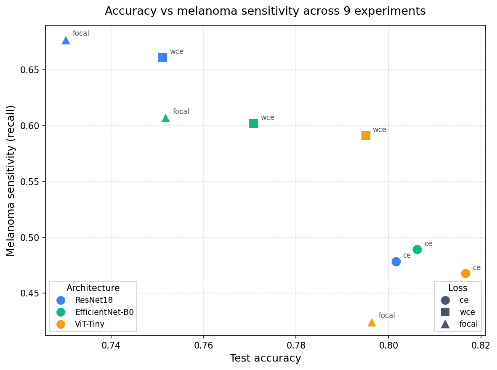

# Skin Lesion Classifier — 醫療影像深度學習

[](https://github.com/liouaquarius/skin-lesion-classifier/actions/workflows/ci.yml)

> Multi-class skin lesion classification on HAM10000: comparing CNN and
> Vision Transformer architectures under class-imbalanced conditions,
> with experiment tracking, automated testing, and end-to-end deployment.

## 免責聲明 / Disclaimer

本專案為**研究與教育用途之展示**。所訓練的模型**並非**經認證的醫療器材，
**不得**用於臨床診斷或任何醫療決策。實際醫療問題請務必諮詢合格的醫療專業人員。

> This project is a research and educational demonstration. The trained models
> are **NOT** certified medical devices and **MUST NOT** be used for clinical
> diagnosis or medical decision-making. Always consult qualified medical
> professionals for actual medical concerns.

完整的適用範圍、訓練資料分布與**模型限制**（少數類樣本不足、melanoma 漏判風險等）見 [MODEL_CARD.md](MODEL_CARD.md)。

HAM10000 資料集採 CC BY-NC 4.0 授權，本專案僅作非商業之教育用途使用。

---

## 專案簡介

在 HAM10000 皮膚鏡影像資料集（10,015 張，7 類，最大不平衡比 58.3×）上建立多類別分類器，
比較 **CNN（ResNet18 / EfficientNet-B0）** 與 **Vision Transformer（ViT-Tiny）** 架構，
並針對類別不平衡設計三組 loss 對照：

| Loss | 說明 |
|------|------|
| `cross_entropy` | 基線 |
| `weighted_ce` | 訓練集頻率的反比權重 |
| `focal` | Focal Loss（γ=2.0），抑制 easy negative |

每組實驗均以 **病灶感知分組切割（lesion-aware split）** 防止資料洩漏，
並以 **MLflow** 追蹤 per-class sensitivity、macro AUC 等指標。
推論結果整合 **Grad-CAM** 熱力圖，透過 **FastAPI + Vue 3** 提供互動式 demo。

## 實驗結果

9 組實驗（3 架構 × 3 loss）於**留出測試集**（病灶感知切割，seed 42）的結果。
`sens(mel)` 為 melanoma（黑色素瘤）敏感度——臨床上最不容漏判的類別。

| 架構 | loss | accuracy | macro F1 | macro AUC | sens(mel) |
|------|------|---------:|---------:|----------:|----------:|
| ResNet18 | ce | 0.8016 | 0.6124 | 0.9556 | 0.478 |
| ResNet18 | wce | 0.7511 | 0.6074 | 0.9411 | 0.661 |
| ResNet18 | focal | 0.7302 | 0.5769 | 0.9273 | 0.677 |
| EfficientNet-B0 | ce | 0.8062 | 0.6491 | 0.9520 | 0.489 |
| EfficientNet-B0 | wce | 0.7708 | 0.6266 | 0.9446 | 0.602 |
| EfficientNet-B0 | focal | 0.7518 | 0.6345 | 0.9462 | 0.608 |
| **ViT-Tiny** | **ce** | **0.8166** | 0.6676 | **0.9603** | 0.468 |
| **ViT-Tiny** | **wce** | 0.7950 | **0.6693** | 0.9602 | 0.591 |
| ViT-Tiny | focal | 0.7963 | 0.6558 | 0.9509 | 0.425 |



**主要發現：**

- **ViT-Tiny 整體領先**：accuracy、macro F1、macro AUC 的最佳值皆由 ViT-Tiny 取得，優於兩個 CNN 基線。
- **準確率 ↔ 少數類敏感度的取捨**：各架構下 `cross_entropy` 的 accuracy 最高，但 melanoma 等少數類敏感度最低；改用 `weighted_ce` / `focal` 會犧牲數個百分點 accuracy，換取明顯更高的 melanoma 敏感度（例如 ResNet18：0.478 → 0.66+）。
- **以臨床「不漏判黑色素瘤」為目標時**，weighted-CE / focal 優於只看 accuracy 的 cross-entropy。

> Demo 後端預設服務 **ViT-Tiny + weighted-CE**（macro F1 最佳、melanoma 敏感度佳，兼顧整體表現與不平衡處理）。每組的混淆矩陣與 per-class sensitivity 圖見 [`results/visualizations/`](results/visualizations/)。

## 技術棧

| 層面 | 技術 |
|------|------|
| 建模 / 訓練 | PyTorch · torchvision · timm · scikit-learn |
| 實驗追蹤 | MLflow |
| 可解釋性 | Grad-CAM（pytorch-grad-cam） |
| 資料 / EDA | pandas · matplotlib · seaborn |
| 後端 | FastAPI · Pydantic · Uvicorn |
| 前端 | Vue 3 · Vite · TypeScript |
| 測試 / 品質 | pytest · pytest-cov · ruff |
| CI / 容器 | GitHub Actions · Docker（CPU-only） |
| 環境管理 | uv（Python 3.11） |

## 快速開始（開發環境）

```bash
# 1. 安裝依賴
uv sync --extra dev

# 2. 下載資料集（需 Kaggle API token）
uv run --extra data python -u scripts/download_data.py

# 3. 執行測試
uv run pytest -v --cov=src --cov-report=term-missing

# 4. 訓練並評估（一條龍：train → 測試集評估；以 ResNet18 + cross-entropy 為例）
uv run python scripts/run_experiment.py configs/resnet18_ce.yaml

# 5. 檢查產物是否齊全（MLflow run + checkpoint / metrics JSON / 圖）
uv run python scripts/inspect_runs.py

# 6. 啟動推論服務（後端）
uv run uvicorn backend.main:app --reload

# 7. 啟動前端（另開 terminal）
cd frontend && npm install && npm run dev
```

瀏覽器開 `http://localhost:5173` 即可上傳影像、取得分類結果與 Grad-CAM 熱力圖。

`run_experiment.py` 會依序對每個 config 執行「訓練 → 測試集評估」，每個 config 在獨立子程序中跑、互不影響，並在結尾列出產物完整性。可一次帶多個 config（例如 `configs/*.yaml` 跑完全部 9 組）；若只想單獨執行某一步，仍可分別呼叫 `python -m src.train` 與 `scripts/bake_results.py`。`inspect_runs.py` 則用於檢查 / 清理 MLflow run 與其磁碟產物。

## 專案架構

```
skin-lesion-classifier/
├── src/
│   ├── data/          # SkinLesionDataset · build_transforms · lesion_aware_split
│   ├── models/        # build_resnet18 · build_efficientnet_b0 · build_vit_tiny
│   ├── losses/        # FocalLoss · WeightedCrossEntropy · build_loss
│   ├── train.py       # 訓練迴圈（MLflow · AMP · cosine LR）
│   ├── evaluate.py    # accuracy · per-class sensitivity · macro F1/AUC · confusion matrix
│   └── inference.py   # Predictor（predict · explain with Grad-CAM）
├── backend/
│   ├── main.py        # FastAPI：POST /predict · POST /explain · GET /health
│   ├── schemas.py     # PredictionResponse · ExplainResponse
│   ├── Dockerfile     # CPU-only 推論 image（python:3.11-slim）
│   └── requirements.txt
├── frontend/          # Vue 3 + TypeScript（Vite dev server，proxy → :8000）
├── configs/           # 9 組：{resnet18,efficientnet_b0,vit_tiny}_{ce,wce,focal}.yaml
├── notebooks/         # 01_eda.ipynb（含輸出）
├── scripts/
│   ├── download_data.py    # Kaggle API 下載並整理 HAM10000
│   ├── bake_results.py     # 測試集評估 → JSON metrics + PNG 視覺化
│   ├── run_experiment.py   # train → bake 一條龍（可批次多個 config）
│   └── inspect_runs.py     # 檢查 / 清理 MLflow run 與產物完整性
├── tests/             # 24 個測試；合成 fixture，CI 不需真實資料集
└── results/
    ├── checkpoints/   # 訓練產生的 .pt（不入庫）
    ├── metrics/       # bake_results 輸出的 JSON
    └── visualizations/  # 混淆矩陣、per-class sensitivity PNG
```

## 授權 License

- **程式碼 Code**：MIT License（見 [LICENSE](LICENSE)）
- **資料集 Dataset**：HAM10000 採 CC BY-NC 4.0，僅供非商業教育用途

## 致謝 Acknowledgements

- **HAM10000 資料集** — Tschandl, P., Rosendahl, C. & Kittler, H., *The HAM10000 dataset: A large collection of multi-source dermatoscopic images of common pigmented skin lesions* (Scientific Data, 2018)；採 CC BY-NC 4.0。
- **預訓練權重** — ImageNet 預訓練模型來自 [torchvision](https://github.com/pytorch/vision) 與 [timm](https://github.com/huggingface/pytorch-image-models)。
